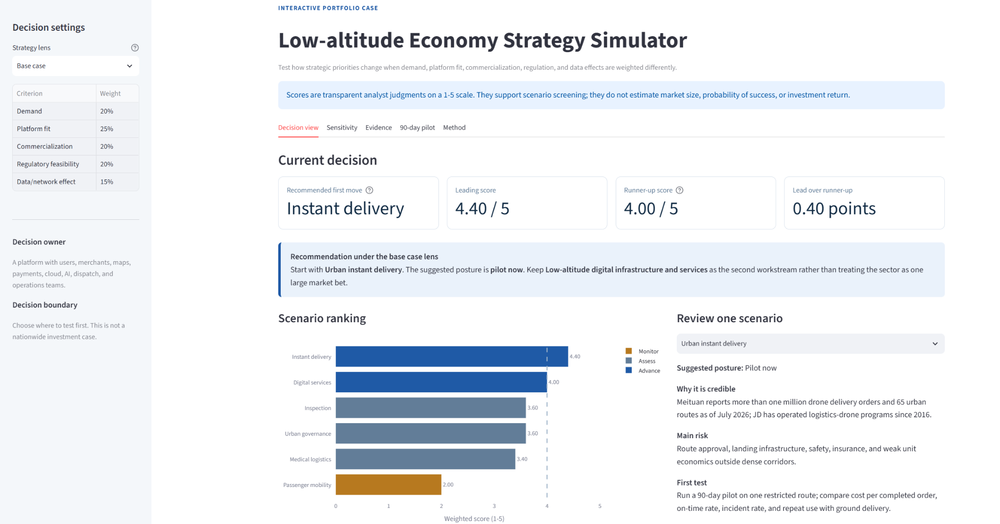
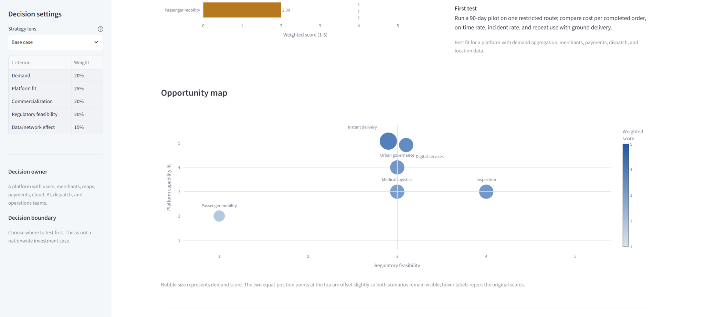
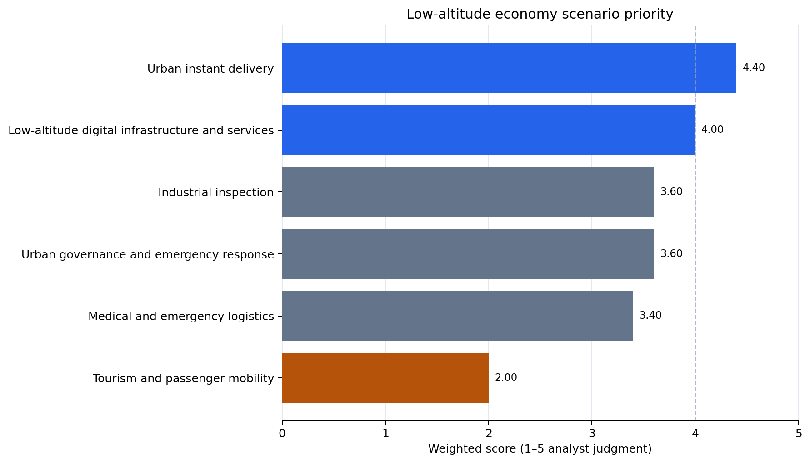
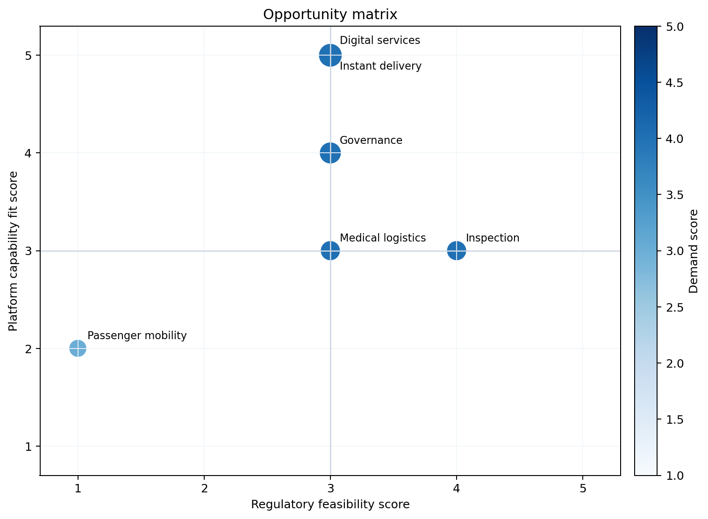

# Low-altitude Economy Scenario Strategy

Which low-altitude economy scenarios should an internet or technology platform enter first?

This portfolio project turns policy, industry operating data, and company cases into a transparent scenario-prioritization model. It takes the perspective of a hypothetical platform company with user traffic, merchant relationships, maps and location services, cloud and AI capabilities, dispatch systems, and operations teams.

[**Open the live simulator**](https://zhang-jin-low-altitude-strategy.streamlit.app/) · [Strategy brief (PDF)](report/low-altitude-economy-strategy-brief.pdf) · [Editable decision model](model/low-altitude-scenario-model.xlsx) · [Methodology](docs/methodology.md)

## Product screenshots

### Decision view

Scenario ranking, recommended entry sequence, and first-test logic.

[](https://zhang-jin-low-altitude-strategy.streamlit.app/)

### Opportunity map

Comparison of regulatory feasibility, platform capability fit, demand, and weighted score.

[](https://zhang-jin-low-altitude-strategy.streamlit.app/)

## Interactive strategy simulator

The Streamlit app lets a reviewer switch among four strategy lenses or set custom criterion weights. It recalculates the six-scenario ranking, shows why each scenario moves, exposes the supporting evidence and risks, and exports a concise decision memo.

The simulator does not generate new facts or recommendations with an AI model. Every result comes from the visible CSV scores, selected weights, and documented rules in this repository.

## Decision summary

The base-case model prioritizes two directions:

1. **Urban instant delivery** — strong demand, high platform fit, and reinforcing route-density data. Entry should begin with restricted routes and measurable unit economics.
2. **Low-altitude digital infrastructure and services** — dispatch, data, risk, cloud, and operational tools offer a more asset-light path across multiple application scenarios.

Industrial inspection and urban governance are credible partnership-led opportunities. Medical and emergency logistics has clear social value but requires tighter operating safeguards. Passenger mobility is not recommended as the first entry because its regulatory, safety, infrastructure, and capital requirements are materially higher.

Scores are analyst judgments on a 1–5 scale, not market forecasts. Facts, sources, assumptions, and judgment calls are kept separate so another analyst can challenge or update the conclusion. Evidence and assumptions are current to 13 September 2026.

## Selected analytical outputs

[Strategy brief (PDF)](report/low-altitude-economy-strategy-brief.pdf) · [Editable Excel decision model](model/low-altitude-scenario-model.xlsx) · [Methodology](docs/methodology.md) · [Live simulator](https://zhang-jin-low-altitude-strategy.streamlit.app/)





## Base-case ranking

| Rank | Scenario | Weighted score | Suggested posture |
| ---: | --- | ---: | --- |
| 1 | Urban instant delivery | 4.40 | Pilot now |
| 2 | Digital infrastructure and services | 4.00 | Build through partnerships |
| 3 | Industrial inspection | 3.60 | Selective B2B entry |
| 3 | Urban governance and emergency response | 3.60 | Government and operator partnerships |
| 5 | Medical and emergency logistics | 3.40 | Controlled corridor pilots |
| 6 | Tourism and passenger mobility | 2.00 | Monitor; do not lead with this scenario |

## What this repository demonstrates

- **Industry research:** official policy and civil-aviation operating evidence are logged in a source ledger.
- **Strategic analysis:** six scenarios are compared with one explicit decision lens and five weighted criteria.
- **Business judgment:** each recommendation includes a main risk and a low-cost first test.
- **Reproducibility:** Python regenerates the ranking, sensitivity table, and figures from the CSV inputs.
- **Communication:** the strategy brief separates evidence, inference, recommendation, and limitation.

## Repository structure

```text
low-altitude-economy-strategy/
├── README.md
├── app.py
├── analysis/
│   ├── decision_support.py
│   └── scenario_scoring.py
├── data/
│   ├── base-case-ranking.csv
│   ├── scenario-scoring.csv
│   ├── sensitivity-results.csv
│   └── source-ledger.csv
├── docs/
│   ├── assumptions-and-limitations.md
│   └── methodology.md
├── figures/
│   ├── opportunity-matrix.png
│   └── scenario-priority.png
├── model/
│   └── low-altitude-scenario-model.xlsx
├── report/
│   ├── low-altitude-economy-strategy-brief.pdf
│   └── strategy-brief.md
├── screenshots/
│   ├── 01-decision-view.png
│   └── 02-opportunity-map.png
├── tests/
│   └── test_scoring.py
├── LICENSE
└── requirements.txt
```

## Run locally

```bash
python -m pip install -r requirements.txt
python -m streamlit run app.py
```

To reproduce the static ranking, sensitivity table, and figures:

```bash
python analysis/scenario_scoring.py
python -m unittest discover -s tests
```

The script writes two figures and a sensitivity-analysis CSV. The Excel model contains editable weights, formula-driven scores, a source ledger, and a concise summary.

## Deployment

On Streamlit Community Cloud, select this repository, use the `main` branch, and set `app.py` as the entrypoint. No secrets are required because the application uses only repository data.

## Author

**ZHANG JIN**  
Northeastern University · Renmin University of China
